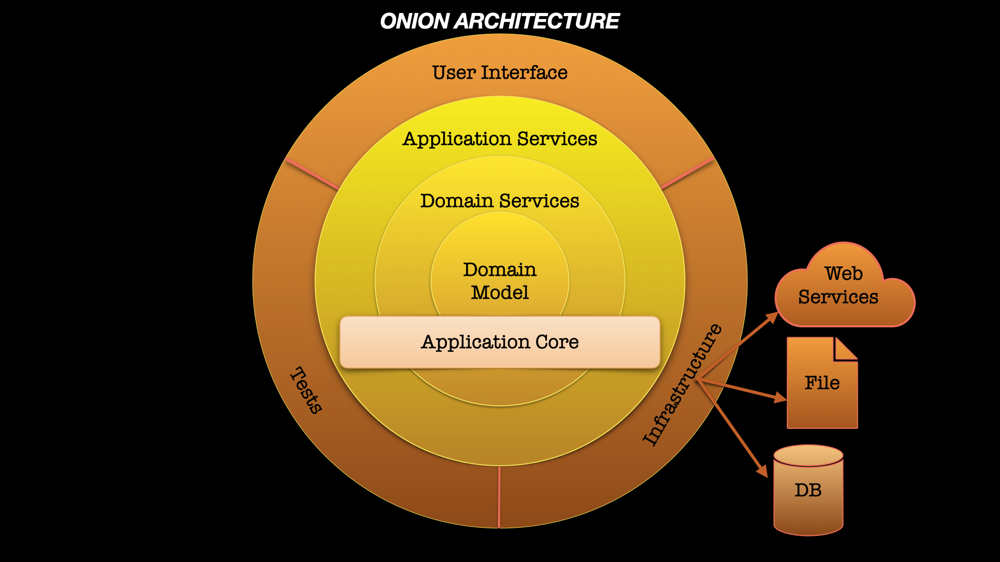

<!--suppress HtmlDeprecatedAttribute -->

  
  <h1 style="width:100%;height:10%;text-align:center;position:relative;top:40%;">Software Engineer Dmytro Turskyi</h1>

<!--suppress HtmlDeprecatedAttribute -->

  <!--- Twitter -->
 
  <!--- my wish board -->
 
  <!--- Goodreads (books I read) -->
 
    <!--- Linkedin (my company) -->
 
    <!--- Facebook (group of clean architecture) -->
 
    <!--- telegram (group of clean architecture) -->
 

### Developing web, android and iOS applications, using:

* Programming languages:
  &nbsp;
  
  &nbsp;
  
  &nbsp;
  &nbsp;

* SDK:
  &nbsp;
  
  &nbsp;
  
  &nbsp;

* Interfaces:
  
  &nbsp;
  
  &nbsp;
  
  &nbsp;

* State management approaches:
  
  
  &nbsp;
  
  &nbsp;

* Dependency injection libraries:
  
  &nbsp;
  
  &nbsp;
  
  &nbsp;

* HTTP client:
  
  &nbsp;

* Database libraries:
  
  &nbsp;
  &nbsp;
  &nbsp;
  
  &nbsp;
  &nbsp;
  
  &nbsp;

* Reactive programming:
  
  &nbsp;
  
  &nbsp;
  
  &nbsp;
  
  &nbsp;

* Version control systems:
  &nbsp;
  &nbsp;

* Git Hosting Services:
  &nbsp;
  
  &nbsp;
  
  &nbsp;

* CI/CD:
  
  &nbsp;
  
  &nbsp;
  
  &nbsp;

* App testing platforms:
  
  &nbsp;
  
  &nbsp;

* App stores:
  
  &nbsp;
  

* Integrated development environments:
  
  &nbsp;
  
  &nbsp;
  
  &nbsp;
  
  &nbsp;
  &nbsp;

* API development platform:
  
  &nbsp;

* Project management tools:
  
  &nbsp;
  &nbsp;
  
  &nbsp;
  
  &nbsp;
  
  &nbsp;  
  &nbsp;

* Showcase platform:
  

    <!--- Start of the list with architectural patterns -->

  
Architectural patterns:
  
[The Clean Architecture](https://blog.cleancoder.com/uncle-bob/2012/08/13/the-clean-architecture.html), [The Onion Architecture](https://jeffreypalermo.com/2008/07/the-onion-architecture-part-1/), [Model-View-ViewModel](https://learn.microsoft.com/en-us/dotnet/architecture/maui/mvvm#the-mvvm-pattern), [Android App Architecture](https://developer.android.com/topic/architecture), [Model-View-Presenter](https://en.wikipedia.org/wiki/Model–view–presenter) 

<a href="https://blog.cleancoder.com/uncle-bob/2012/08/13/the-clean-architecture.html">
 <!--suppress CheckImageSize -->
 
</a>

<a href="https://jeffreypalermo.com/2008/07/the-onion-architecture-part-1/">
 <!--suppress CheckImageSize -->
 
</a>

<a href="https://learn.microsoft.com/en-us/dotnet/architecture/maui/mvvm#the-mvvm-pattern">
 <!--suppress CheckImageSize -->
 
</a>

<a href="https://developer.android.com/topic/architecture">
 <!--suppress CheckImageSize -->
 
</a>

<a href="https://en.wikipedia.org/wiki/Model–view–presenter">
 <!--suppress CheckImageSize -->
 
</a>

    <!--- end of the list with architectural patterns -->
    
-----

### Experience:

<table style="width:100%">
      <!--- CMiC -->
  <tr>
    <th>
     
    </th>
    <th>2022-...</th>
  </tr>
       <!--- MR Studio -->
  <tr>
    <td>
     <a href="https://www.facebook.com/MyRoadStudio">
      <!--suppress CheckImageSize -->
      
     </a>
    </td>
    <td>2020-2022</td>
  </tr>
         <!--- dev craft -->
  <tr>
    <td>
     <a href="https://www.linkedin.com/company/dev-craft/">
      <!--suppress CheckImageSize -->
      
     </a>
    </td>
    <td>2019-2020</td>
  </tr>
</table>

## <b> Github Stats </b>

<!--- stats (start) -->
<table style="width:100%">
 <tr border="none">
  <td>
   
     
    
  </td>

  <td >
   
  </td>
 </tr>
</table>
<!--- stats (end) -->

